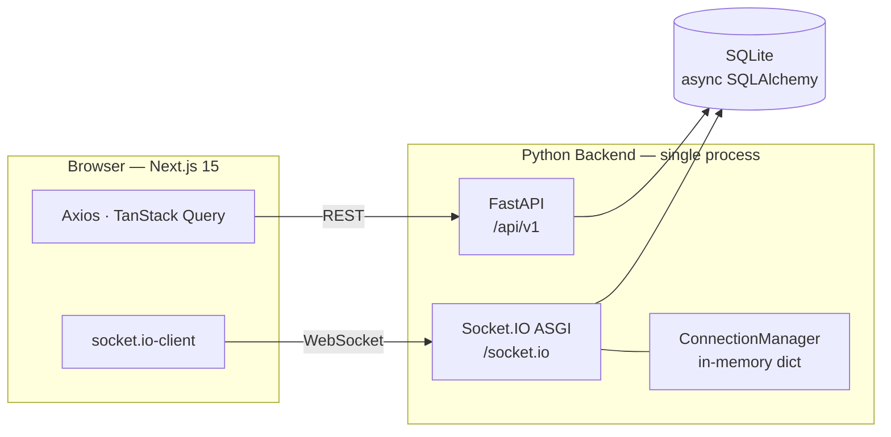
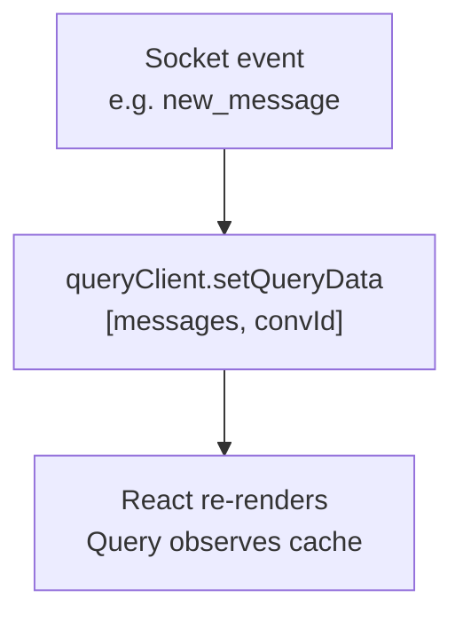
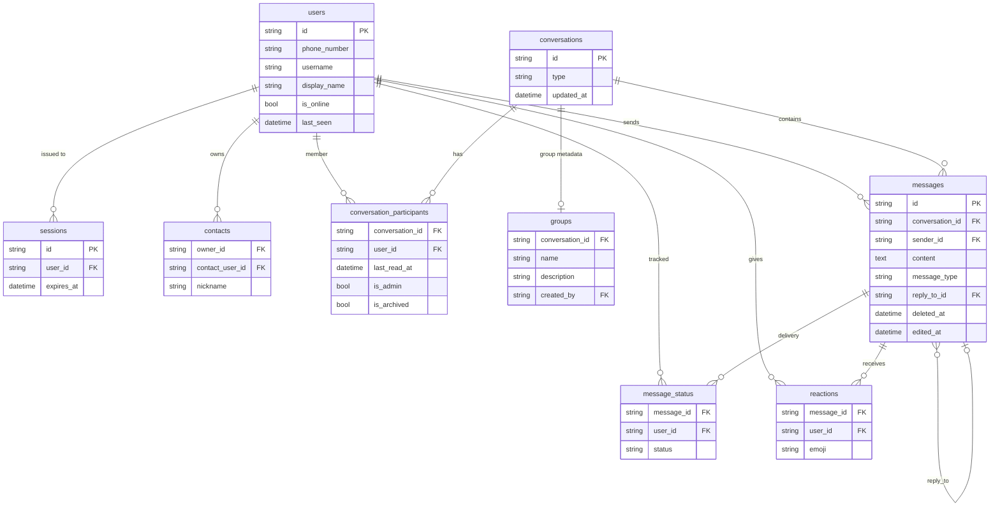

# Signal Clone

A real-time messaging app built with FastAPI + Next.js 15. This document covers the decisions I made, the tradeoffs I accepted, and the things that broke along the way.

**Live:** https://signal-clone-xi.vercel.app  
**API Docs:** https://signal-clone-2han.onrender.com/docs

---

## What's actually built

- Phone + OTP login (OTP is always `123456` — no SMS provider)
- Direct and group conversations with real-time delivery
- Typing indicators that show the sender's name, not their ID
- Message reactions, edits, soft deletes, and reply threads
- Read receipts with per-message status ticks (sent → delivered → read)
- Online/last-seen presence that handles multiple open tabs correctly
- Responsive layout — mobile shows one panel at a time, desktop shows three columns
- Dark/light/system theme with no flash on hard refresh
- Image and file attachments via Cloudinary (paperclip button in message input, preview before send)

**What's explicitly not built:** actual E2E encryption (the notice in the UI is a mock), voice/video calls, stories.

---

## Tech Stack

**Backend:** FastAPI · SQLAlchemy 2 (async) · SQLite · python-socketio · Alembic · JWT auth  
**Frontend:** Next.js 15 App Router · React 19 · TypeScript · Tailwind CSS v4 · Zustand · TanStack Query · socket.io-client

---

## Architecture

The most important structural decision was keeping everything in one process:



Socket.IO is mounted as an ASGI sub-application *inside* FastAPI — not a separate service. No Redis, no message broker, no deploy complexity. The tradeoff: it won't scale horizontally. A Redis adapter would be needed for multiple instances. For a single-instance demo, the simplicity is worth it.

### How real-time state works

Socket handlers write directly into TanStack Query's cache — there's no parallel event store:



One source of truth for server data. The socket is just a push channel for cache updates, not a separate state system.

### Presence — the multi-tab problem

If a user has two tabs open and closes one, they should stay online. The fix is counting connections per user, not just tracking connected/disconnected:

```python
_connections: dict[str, set[str]]  # user_id → {sid, sid, ...}
```

`user_offline` only emits when the *last* tab disconnects. Every other disconnect is silent.

---

## Database Design

SQLite with async SQLAlchemy. Every PK is a UUID string — avoids sequential ID leakage and keeps IDs safe in URLs.

**9 tables:** `users` · `sessions` · `contacts` · `conversations` · `conversation_participants` · `groups` · `messages` · `message_status` · `reactions`

Three decisions worth explaining:

**Sessions table for a "stateless" JWT app.** JWT is normally stateless — validate the signature, trust the payload, done. I added a sessions table because stateless JWTs can't be revoked: a stolen token stays valid until expiry. The extra DB lookup on each request is the cost; actual logout is the benefit.

**Soft deletes via `deleted_at`, not a boolean.** When a message is deleted, `content` is cleared and `deleted_at` is stamped. The row stays. This is how Signal works — the "This message was deleted" ghost keeps reply threads coherent and avoids orphaned `reply_to_id` references. A hard delete would cascade-null those FKs and lose context.

**Unread counts are computed, not stored.** `conversation_participants.last_read_at` is a cursor timestamp. Unread = messages after that cursor, excluding own. No counter column that can drift out of sync with actual reads.

### Entity Relationship Diagram



### Full schema

<details>
<summary>Click to expand all tables</summary>

**`users`** — accounts, OTP, presence

| Column | Type | Notes |
|---|---|---|
| `id` | UUID PK | |
| `phone_number` | TEXT UNIQUE | E.164, login identifier |
| `username` | TEXT UNIQUE | 3–30 chars, lowercase alphanumeric + `_` |
| `display_name` | TEXT | |
| `avatar_url` | TEXT | nullable |
| `bio` | TEXT | default `""` |
| `otp_code` | TEXT | nullable, cleared after verify |
| `otp_expires_at` | DATETIME | nullable, 10-min window |
| `is_online` | BOOLEAN | real-time flag |
| `last_seen` | DATETIME | nullable, set on disconnect |
| `created_at`, `updated_at` | DATETIME | |

**`sessions`** — one row per issued JWT

| Column | Type | Notes |
|---|---|---|
| `id` | UUID PK | also the JWT `jti` claim |
| `user_id` | FK → users CASCADE | |
| `token` | TEXT UNIQUE | full JWT string |
| `expires_at` | DATETIME | issued + 7 days |

**`contacts`** — asymmetric address book

| Column | Type | Notes |
|---|---|---|
| `owner_id` | FK → users | |
| `contact_user_id` | FK → users | |
| `nickname` | TEXT | nullable display override |
| UNIQUE | `(owner_id, contact_user_id)` | adding Bob doesn't add Alice |

**`conversations`**

| Column | Type | Notes |
|---|---|---|
| `id` | UUID PK | |
| `type` | TEXT | `'direct'` or `'group'` |
| `updated_at` | DATETIME | bumped on every message for sort |

**`conversation_participants`** — membership + per-user state

| Column | Type | Notes |
|---|---|---|
| `conversation_id` | FK → conversations | |
| `user_id` | FK → users | |
| `last_read_at` | DATETIME | nullable, drives unread count |
| `is_admin` | BOOLEAN | group admin |
| `is_archived` | BOOLEAN | per-user archive |

**`groups`**

| Column | Type | Notes |
|---|---|---|
| `conversation_id` | FK → conversations UNIQUE | 1-to-1 |
| `name`, `description`, `avatar_url` | TEXT | |
| `created_by` | FK → users | for delete authorization |

**`messages`**

| Column | Type | Notes |
|---|---|---|
| `conversation_id` | FK → conversations | |
| `sender_id` | FK → users | |
| `content` | TEXT | cleared on soft delete |
| `message_type` | TEXT | `text` · `image` · `file` · `system` |
| `reply_to_id` | FK → messages | SET NULL if parent deleted |
| `deleted_at` | DATETIME | nullable, soft delete |
| `edited_at` | DATETIME | nullable |
| `disappears_at` | DATETIME | nullable, reserved for ephemeral |

**`message_status`** — delivery/read tracking

| Column | Type | Notes |
|---|---|---|
| `message_id` | FK → messages | |
| `user_id` | FK → users | |
| `status` | TEXT | `'delivered'` or `'read'` |
| UNIQUE | `(message_id, user_id)` | upserted, not inserted |

**`reactions`**

| Column | Type | Notes |
|---|---|---|
| `message_id` | FK → messages | |
| `user_id` | FK → users | |
| `emoji` | TEXT | |
| UNIQUE | `(message_id, user_id)` | one reaction per user per message |

</details>

---

## API

Base: `/api/v1` · Auth: `Authorization: Bearer <token>` (all routes except `/auth/register`, `/auth/send-otp`, `/auth/verify-otp`)

| Group | Endpoints |
|---|---|
| Auth | `POST /auth/register` · `POST /auth/send-otp` · `POST /auth/verify-otp` · `POST /auth/logout` · `GET /auth/me` |
| Users | `GET /users/search?q=` · `PATCH /users/me` · `GET /users/{id}` |
| Contacts | `GET /contacts` · `POST /contacts` · `PATCH /contacts/{id}` · `DELETE /contacts/{id}` |
| Conversations | `GET /conversations` · `POST /conversations/direct` · `GET /conversations/{id}` · `POST /conversations/{id}/read` |
| Messages | `GET /conversations/{id}/messages` · `POST /conversations/{id}/messages` · `PATCH /messages/{id}` · `DELETE /messages/{id}` · `PUT /messages/{id}/reactions` |
| Groups | `POST /groups` · `GET /groups/{id}` · `PATCH /groups/{id}` · `DELETE /groups/{id}` · `POST /groups/{id}/members` · `DELETE /groups/{id}/members/{user_id}` |

Full interactive docs at `/docs`.

---

## WebSocket Events

Connect to `/socket.io` with `{ auth: { token: "<jwt>" } }`.

**Client → Server:** `typing` · `stop_typing` · `message_read` · `join_conversation`

**Server → Client:** `new_message` · `message_edited` · `message_deleted` · `reaction_updated` · `typing` · `stop_typing` · `user_online` · `user_offline` · `conversation_read` · `message_status_update` · `group_updated` · `group_deleted` · `member_added` · `member_removed`

---

## Bugs I actually fixed

These tell you more about the codebase than a feature list does.

**Typing indicator showed a user ID instead of a name.** The backend `typing` event only emitted `user_id`. Fixed by storing `display_name` in `ConnectionManager` at connect time (the user object is already loaded during JWT auth, so no extra query) and including it in the event payload.

**Group info panel showed `@` for every member.** The `/groups/{id}` endpoint returned participants as `{ user: UserPublic, is_admin, joined_at }` — nested. The frontend expected a flat shape. Fixed with a `normalizeGroup()` function in the API layer that flattens before any component sees the data.

**Dark mode nav icons were black on a dark background.** The nav rail used `style={{ color: "var(--color-nav-icon)" }}` with a CSS custom property set in `.dark { }`. It didn't work — Tailwind v4's `@custom-variant dark (&:is(.dark *))` powers utility classes, not CSS variable resolution in inline styles. Fixed by replacing the inline style with Tailwind `dark:` classes (`dark:text-white/50`).

**Dark mode flashed the wrong colors on hard refresh.** `ThemeApplier` set `.dark` on `<html>` inside `useEffect` — after the first paint. Fixed with a synchronous inline `<script>` in `<head>` that reads `localStorage` before React renders. Same technique `next-themes` uses.

**Render deployed Python 3.14 instead of 3.11.** `runtime.txt` was ignored. Fixed by adding `.python-version` (which Render actually reads) and unpinning `pydantic` to allow compatible wheels.

**Render went cold between requests.** Free tier suspends after 15 minutes idle. Fixed with a GitHub Actions cron that pings `/health` every 10 minutes.

---

## Local Setup

**Backend**

```bash
cd backend
python -m venv venv && source venv/bin/activate  # Windows: venv\Scripts\activate
pip install -r requirements.txt
cp .env.example .env   # set SECRET_KEY to any 32+ char string
alembic upgrade head
python -m app.seed.seed
uvicorn app.main:app --reload --port 8000
```

**Frontend**

```bash
cd frontend
npm install
# Optional: add Cloudinary credentials for attachment uploads
# Create frontend/.env.local with:
#   NEXT_PUBLIC_CLOUDINARY_CLOUD_NAME=your_cloud_name
#   NEXT_PUBLIC_CLOUDINARY_UPLOAD_PRESET=your_unsigned_preset
npm run dev
```

App at `http://localhost:3000` · API at `http://localhost:8000` · Docs at `http://localhost:8000/docs`

---

## Test Accounts

All use OTP **`123456`**. Pre-seeded with 6 direct chats and 3 group conversations (Team Alpha, Weekend Plans, Book Club) including message history, reactions, and reply threads.

| Phone | Username |
|---|---|
| +919810000001 | alice |
| +919810000002 | bob |
| +919810000003 | carol |
| +919810000004 | dave |
| +919810000005 | eve |
| +919810000006 | frank |
| +919810000007 | grace |
| +919810000008 | henry |

---

## Assumptions

- **OTP is mocked.** `123456` always works. Plugging in Twilio is ~20 lines; it costs money to run.
- **SQLite over Postgres.** Zero infrastructure for local dev. The async SQLAlchemy layer is DB-agnostic — switching is a one-line connection string change. The real cost is no concurrent writes at scale.
- **Attachments go to Cloudinary.** Images and files are uploaded directly from the browser to a Cloudinary unsigned preset. Files persist on Cloudinary's CDN — no server-side storage needed, no ephemeral-disk problem on Render. Requires `NEXT_PUBLIC_CLOUDINARY_CLOUD_NAME` and `NEXT_PUBLIC_CLOUDINARY_UPLOAD_PRESET` in the frontend env. Without these vars, the paperclip button is visible but upload will fail with an informative error.
- **Ephemeral messages are schema-only.** `messages.disappears_at` is modelled but no background job reads it.
- **E2E encryption is a UI label.** Messages are stored and transmitted in plaintext. Full Signal Protocol (X3DH, double ratchet, sealed sender) is not implemented.
- **Single-instance WebSocket.** `ConnectionManager` uses an in-process dict. Works for one server; needs a Redis adapter for horizontal scale.
